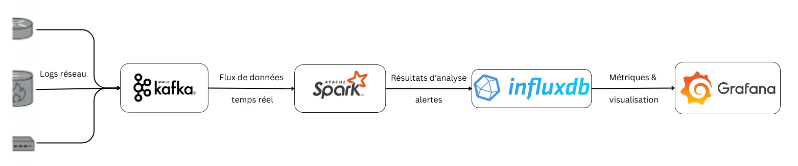
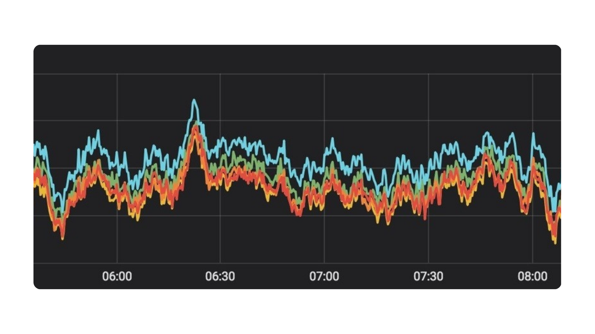
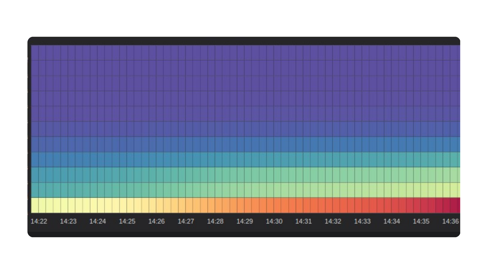
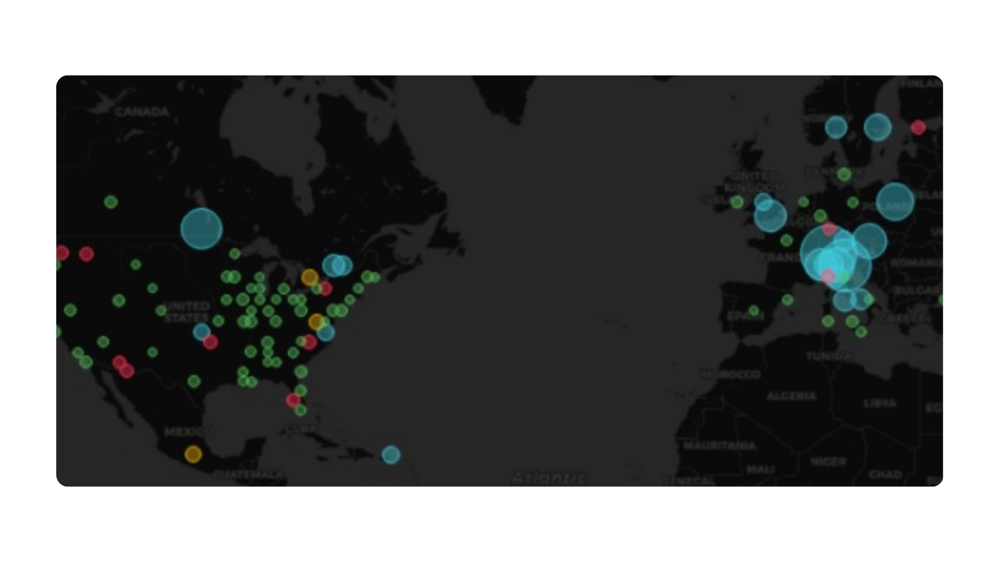
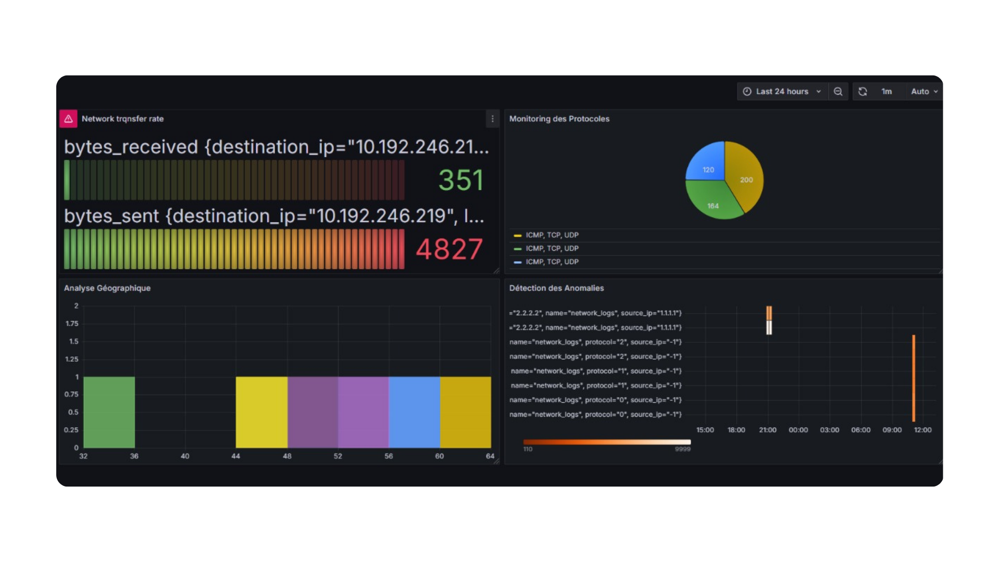

# 🚀 Big Data Cybersecurity Threat Detection

A real-time cybersecurity threat detection system using Big Data technologies and Machine Learning.  
Developed as part of the **Distributed Computing & Big Data** course at ENSA El Jadida, UCD.

---

## 📑 Table of Contents
1. [Project Overview](#-project-overview)  
2. [Architecture](#-architecture)  
3. [Technology Stack](#-technology-stack)  
4. [Project Components](#-project-components)  
5. [Getting Started](#-getting-started)  
6. [Results](#-results)  
7. [Screenshots](#screenshots)
8. [Authors](#-authors)  
9. [License](#-license)  

---

## 🎯 Project Overview

**Goal**: Detect anomalies and predict potential cyber threats (DDoS, malware, phishing, ransomware) from network traffic logs in real-time.

**Approach**:
- Generate synthetic network logs
- Stream logs via **Apache Kafka**
- Process with **Apache Spark Streaming**
- Apply trained **ML model** for threat classification
- Store results in **InfluxDB**
- Visualize anomalies and traffic in **Grafana**

---

## 🏗️ Architecture

  
*Complete pipeline architecture showing data flow from log generation to visualization : [Log Generator] → [Kafka Producer] → [Kafka Topic: logs] → [Spark Streaming + ML Model] → [InfluxDB] → [Grafana Dashboard]*

---

## ⚙️ Technology Stack

- **Docker Compose** – Service orchestration  
- **Apache Kafka** – Data ingestion  
- **Apache Spark Streaming** – Real-time data processing  
- **Scikit-learn** – Machine Learning (Logistic Regression - F1 = 0.77)  
- **InfluxDB** – Time-series database  
- **Grafana** – Interactive visualization  
- **Jupyter Notebooks** – Development & experimentation  

---

## 📂 Project Components

- [`notebooks/generator.ipynb`](./notebooks/generator.ipynb) → Generates synthetic network logs (`log.csv`)  
- [`notebooks/kafka_producer.ipynb`](./notebooks/kafka_producer.ipynb) → Sends logs to Kafka topic `logs`  
- [`notebooks/kafka_consumer.ipynb`](./notebooks/kafka_consumer.ipynb) → Debug consumer to check Kafka messages  
- [`notebooks/train_threat_classifier.ipynb`](./notebooks/train_threat_classifier.ipynb) → Trains ML models, saves best (`best_model.joblib`)  
- [`notebooks/spark_streaming.ipynb`](./notebooks/spark_streaming.ipynb) → Reads logs from Kafka (debug view)  
- [`notebooks/spark_processing.ipynb`](./notebooks/spark_processing.ipynb) → Full pipeline: Kafka → Spark → ML → InfluxDB  
- [`docker-compose.yml`](./docker-compose.yml) → Runs Zookeeper, Kafka, Jupyter, InfluxDB, Grafana 

---

## 🚀 Getting Started

### 1. Start Infrastructure
`docker compose up -d`

### 2. Generate Logs
Run `generator.ipynb` → creates `log.csv`

### 3. Send Logs to Kafka
Run `kafka_producer.ipynb`

### 4. Process with Spark Streaming
Run `spark_processing.ipynb` → applies ML model & writes to InfluxDB

### 5. Visualize in Grafana
- Open http://localhost:3000
- Login: `admin / admin`
- Connect to InfluxDB: (URL: `http://influxdb:8086`, Organization: `myorg`, Bucket: `mybucket`)
- Create dashboards for:
    - Threat detection
    - Traffic volume
    - Geographic analysis
    - Protocol usage

---

## 📊 Results

**Machine Learning Performance:**
- Best Model: **Logistic Regression**
- F1 Score: **0.77**

**Grafana Dashboards:**
- Real-time anomaly detection
- Top malicious IPs
- Geographic threat map
- Protocol monitoring

---

## 📸 Screenshots

### 🔹 Grafana Dashboards

**Network Traffic Analysis**  
  
*Real-time network traffic volume and protocol monitoring*

**Real-time Threat Detection Dashboard**  
  
*Live monitoring of cybersecurity threats and anomalies*

**Geographic Threat Map**  
  
*Geographic visualization of threat origins and distribution*

**Protocol Usage Monitoring**  
  
*Analysis of network protocols and associated threats*

---

## 👨‍💻 Authors

- **Abdelaziz Ariri**
- **Fahd El Attar**
- **Mohammed Bardaoui**

**Supervised by:** Pr. Hanine & Pr. El Akrami
**Academic Year:** 2024 / 2025

---

## 📜 License

This project is for academic and educational purposes.